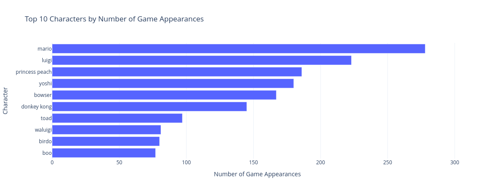
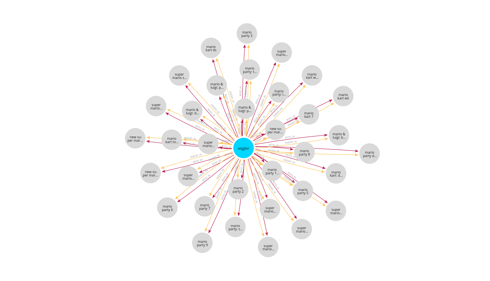
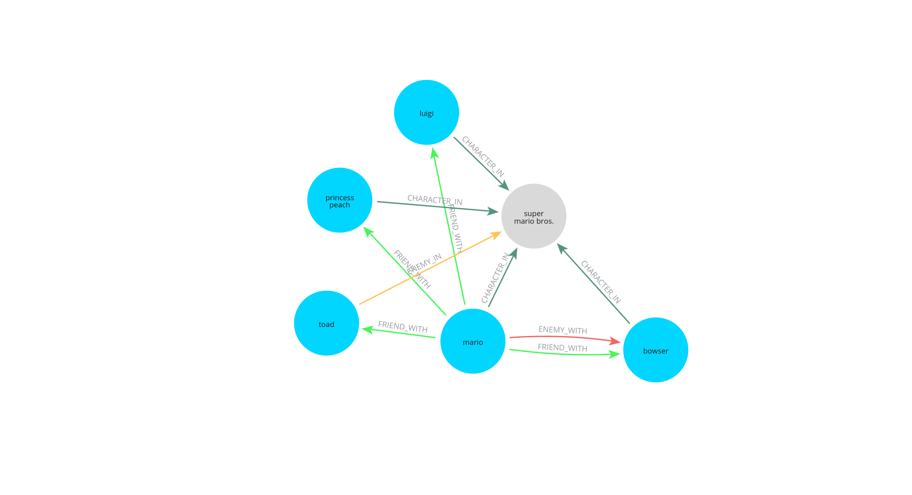

# 🏰 Super Mario Graph Database

A Neo4j-based knowledge graph capturing the relationships among main characters, bosses, general enemies, and video games from the **Super Mario** franchise, following a complete data processing pipeline, from Data Acquisition to Data Storage. In fact, it was built through Web Scraping, API integration, and data enrichment. The project creates an interactive network of Mario Universe entities, enabling advanced querying and graph-based exploration.

All technical details are available in the [Report](/Report.pdf).

## 📚 Table of Contents

- [Overview](#overview)
- [Data Sources](#data-sources)
- [Installation](#installation)
- [Execution Pipeline](#execution-pipeline)
- [Database Design](#database-design)
- [Sample Queries](#sample-queries)
- [Data Quality](#data-quality)
- [Future Work](#future-work)

---

## 📖 Overview

This project constructs a graph database that models:

- **Characters** (main/plot, general enemies, bosses),
- **Games** (release year, console/platform, and sales figures),
- **Character roles in games**,
- **Interpersonal relationships** (i.e., friends and enemies).

The final result is a Neo4j AuraDB instance featuring over 1000 nodes and nearly 9500 relationships, allowing users to visually and semantically explore the Super Mario franchise.

---

## 🌐 Data Sources

1. **🕸️ Mario Wiki (Web Scraping)**
   - Characters, enemies, bosses, and games.
   - Extracted using `BeautifulSoup`, `requests`, and `pandas`.

2. **📦 Giant Bomb API**
   - Character-to-character relationships (e.g., `FRIEND_WITH`, `ENEMY_WITH`).
   - Accessed via RESTful API with authentication and rate-limiting.

3. **📊 Kaggle – Video Game Sales Dataset**
   - Enriched games data with sales figures.
   - Filtered and matched with scraped Mario games.

---

## 🧩 Installation

1. Clone the repository.

2. Install requirements:
   ```bash
   pip install -r requirements.txt
   ```

3. Configure your `.env` file:
   ```
   GIANTBOMB_API_KEY=your_api_key
   NEO4J_URI=bolt://your-uri # Using AuraDB: neo4j+s://your-uri
   NEO4J_USER=your_user
   NEO4J_PASSWORD=your_password
   ```

---

## 🧪 Execution Pipeline

Run the following notebooks **in order**:

| Notebook                                | Description                                                |
|-----------------------------------------|------------------------------------------------------------|
| `Data_Acquisition_Characters_and_Games.ipynb` | Scrapes characters, games, and loads sales data      |
| `Data_Acquisition_Enemies.ipynb`       | Scrapes enemy characters                                    |
| `Data_Acquisition_Bosses.ipynb`        | Scrapes bosses and species info                             |
| `Data_Acquisition_API.ipynb`           | Queries Giant Bomb API for general character relationships  |
| `Data_Integration.ipynb`               | Cleans, merges and fuses all datasets                       |
| `Data_Quality.ipynb`                   | Assesses completeness, redundancy, consistency and more     |
| `Data_Storage_GraphDB.ipynb`           | Builds and uploads the graph to Neo4j                       |

---

## ⚙️ Database Design

### 🍄🐢 Character Nodes

| Property | Description                                |
|----------|--------------------------------------------|
| `name`   | Character's name                           |
| `species`| Biological or fictional classification     |

### 🎮🕹️ Game Nodes

| Property | Description            |
|----------|------------------------|
| `name`   | Game title             |
| `console`| Platform or system     |
| `year`   | Release year           |
| `sales`  | Number of units sold   |

### 🔗 Relationships

| Type            | Description                             |
|-----------------|-----------------------------------------|
| `CHARACTER_IN`  | Character appears in a game             |
| `ENEMY_IN`      | Enemy appears in a game                 |
| `BOSS_IN`       | Boss appears in a game                  |
| `FRIEND_WITH`   | Character is friend with another        |
| `ENEMY_WITH`    | Character is enemy with another         |

All relationships are **directed** and **typed**, dynamically generated using **Cypher** language and **APOC** procedures.

---

## 🔍 Sample Queries

**Top 10 Characters by Game Appearances**
```cypher
MATCH (c:Character)-[]->(g:Game)
RETURN c.name AS Character, COUNT(DISTINCT g) AS Appearances
ORDER BY Appearances DESC
LIMIT 10
```


**Games Featuring 'Wiggler'**
```cypher
MATCH p = (c:Character {name: 'wiggler'})-[r]->(g:Game)
RETURN p
```


**Mario's Friends/Enemies in a Specific Game**
```cypher
MATCH (c1:Character)-[r:FRIEND_WITH|ENEMY_WITH]->(c2:Character)-[a1]->(g:Game)<-[a2]-(c1)
WHERE c1.name = "mario" AND g.name = "super mario bros." AND g.console = "NES"
RETURN c1, r, c2, a1, g, a2
```


---

## ✅ Data Quality

We assessed the data based on:

- **Completeness:** Most fields >88% complete; Species data missing in ~73% of bosses.
- **Redundancy:** 100% deduplicated post-integration.
- **Consistency:** Console/platform names normalized from 73 to 27 unique values (63% reduction).
- **Accuracy & Currency:** Verified via cross-sources; reflects full Mario timeline.

---

## ➡️ Future Work

- Add fuzzy-matching to improve entity correspondence.
- Expand data sources (e.g., additional wikis or structured databases).
- Build a web dashboard for fans to explore the graph visually.
- Integrate with **LLM-based RAG systems** using tools like LangChain or LlamaIndex + Neo4j.

---

## 📎 Acquisition's References

- [Mario Wiki](https://www.mariowiki.com/)
- [GiantBomb API](https://www.giantbomb.com/api/)
- [Video Game Sales Dataset (Kaggle)](https://www.kaggle.com/datasets/thedevastator/video-game-sales-and-ratings)
